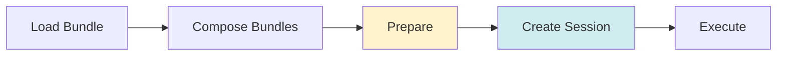

# Getting Started with amplifier-foundation

Get your first bundle-based Amplifier application running in minutes.

## Installation

```bash
uv add amplifier-foundation
```

## Hello World

The simplest possible amplifier-foundation application:

```python
import asyncio
from pathlib import Path
from amplifier_foundation import load_bundle

async def main():
    # Load the foundation bundle from the repo
    foundation = await load_bundle("git+https://github.com/microsoft/amplifier-foundation@main")
    print(f"✓ Loaded: {foundation.name} v{foundation.version}")
    
    # Load a provider bundle
    provider = await load_bundle("git+https://github.com/microsoft/amplifier-foundation@main#subdirectory=providers/anthropic-sonnet.yaml")
    print(f"✓ Loaded provider: {provider.name}")
    
    # Compose them
    composed = foundation.compose(provider)
    print("✓ Composed bundles")
    
    # Prepare (download modules if needed)
    print("⏳ Preparing...")
    prepared = await composed.prepare()
    print("✓ Modules prepared")
    
    # Create session and execute
    async with await prepared.create_session() as session:
        response = await session.execute("Write a haiku about Python programming")
        print(f"\nResponse:\n{response}")

if __name__ == "__main__":
    import os
    if not os.getenv("ANTHROPIC_API_KEY"):
        print("❌ Set ANTHROPIC_API_KEY environment variable")
        exit(1)
    
    asyncio.run(main())
```

**Output:**
```
✓ Loaded: foundation v1.0.0
✓ Loaded provider: anthropic-sonnet
✓ Composed bundles
⏳ Preparing...
✓ Modules prepared

Response:
Code flows like water
Functions branch and merge as trees
Python's grace in code
```

## The Core Workflow

amplifier-foundation follows a clear pattern:



### 1. Load Bundles

```python
foundation = await load_bundle(source)
```

Load bundles from:
- Git URLs: `git+https://github.com/org/repo@ref`
- Local paths: `./bundles/my-bundle.md`
- With subdirectories: `git+...@main#subdirectory=path/to/bundle`

### 2. Compose Bundles

```python
composed = foundation.compose(provider).compose(tools)
```

Layer configurations:
- Foundation → Base configuration
- Provider → LLM backend
- Tools → Additional capabilities
- Later overrides earlier

### 3. Prepare

```python
prepared = await composed.prepare()
```

Downloads and activates modules:
- Resolves git sources
- Downloads to `~/.amplifier/modules/`
- First run: 30s+ (downloading)
- Subsequent: instant (cached)

### 4. Create Session

```python
session = await prepared.create_session()
```

Creates an AmplifierSession instance with all modules loaded.

### 5. Execute

```python
async with session:
    response = await session.execute(prompt)
```

Run prompts through the configured agent.

## Bundle Structure

Bundles are markdown files with YAML frontmatter:

```yaml
---
bundle:
  name: my-bundle
  version: 1.0.0
  description: My custom bundle

session:
  orchestrator: 
    module: loop-streaming
    source: git+https://github.com/microsoft/amplifier-module-loop-streaming@main
  context:
    module: context-simple
    source: git+https://github.com/microsoft/amplifier-module-context-simple@main

providers:
  - module: provider-anthropic
    source: git+https://github.com/microsoft/amplifier-module-provider-anthropic@main
    config:
      default_model: claude-sonnet-4-5
      api_key_env: ANTHROPIC_API_KEY

tools:
  - module: tool-filesystem
    source: git+https://github.com/microsoft/amplifier-module-tool-filesystem@main
  - module: tool-bash
    source: git+https://github.com/microsoft/amplifier-module-tool-bash@main

hooks:
  - module: hooks-logging
    source: git+https://github.com/microsoft/amplifier-module-hooks-logging@main
---

You are a helpful AI assistant with access to filesystem and bash tools.
Follow the user's instructions carefully.
```

## Common Patterns

### Use Foundation + Provider

Most applications start with foundation + provider:

```python
foundation = await load_bundle("git+https://github.com/microsoft/amplifier-foundation@main")
provider = await load_bundle("./providers/anthropic-sonnet.yaml")
composed = foundation.compose(provider)
```

### Add Tools

Compose in additional capabilities:

```python
from amplifier_foundation import Bundle

tools = Bundle(
    name="tools",
    version="1.0.0",
    tools=[
        {
            "module": "tool-filesystem",
            "source": "git+https://github.com/microsoft/amplifier-module-tool-filesystem@main"
        }
    ]
)

composed = foundation.compose(provider).compose(tools)
```

### Reuse Prepared Bundles

Prepare once, create multiple sessions:

```python
prepared = await composed.prepare()

# Session 1
async with await prepared.create_session() as session:
    await session.execute("Task 1")

# Session 2
async with await prepared.create_session() as session:
    await session.execute("Task 2")
```

## Troubleshooting

### First run is slow

**Problem:** `prepare()` takes 30+ seconds

**Solution:** This is normal on first run while modules download. Subsequent runs use the cache.

Check cache:
```bash
ls -la ~/.amplifier/modules/
```

### Module not found

**Problem:** `ModuleNotFoundError` during prepare

**Solution:** Ensure modules have `source:` fields:

```yaml
tools:
  - module: tool-bash
    source: git+https://github.com/microsoft/amplifier-module-tool-bash@main
```

### API key errors

**Problem:** Authentication errors

**Solution:** Set your API key:

```bash
export ANTHROPIC_API_KEY='your-key-here'
# or
export OPENAI_API_KEY='your-key-here'
```

## Next Steps

<div class="grid cards" markdown>

-   :material-school: __Learn by Example__

    ---

    [Examples Gallery →](examples/)
    
    Progressive examples from hello world to production apps

-   :material-book: __Core Concepts__

    ---

    [Understand Bundles →](concepts.md)
    
    Mental model for bundle composition

-   :material-cube: __Bundle System__

    ---

    [Deep Dive →](bundle_system.md)
    
    Loading, composition, validation, preparation

</div>
